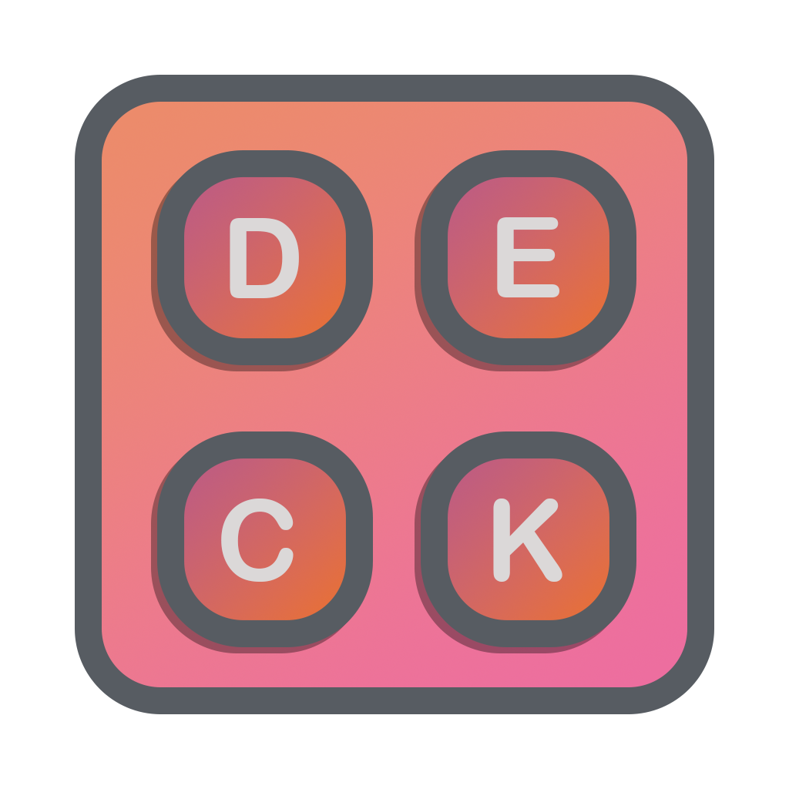

 

  

  <h3 align="center">KitsuDeckDash</h3>

  

    The Program for the KitsuDeck
     
     
    <a href="https://github.com/KitsuneYokai/KitsuDeckDash/issues">Report Bug</a>
    .
    <a href="https://github.com/KitsuneYokai/KitsuDeckDash/issues">Request Feature</a>
  

## Table Of Contents

- [Table Of Contents](#table-of-contents)
- [About The Project](#about-the-project)
- [Built With](#built-with)
- [Usage](#usage)
- [License](#license)
- [Authors](#authors)
- [Thinks to note](#thinks-to-note)

## About The Project

This is the Desktop program for the [KitsuDeck](https://github.com/KitsuneYokai/KitsuDeck)

In this program you will be able to set your macro keys for the KitsuDeck.

It also serves as a bridge from your pc to the Deck.

## Built With

* [Flutter](https://flutter.dev)

## Usage

Download the program and open it. I will finish this section of the README later

## License

Distributed under the MIT License. See [LICENSE](https://github.com/KitsuneYokai/KitsuDeckDash/blob/main/LICENSE) for more information.

## Authors

* [KitsuneYokai](https://github.com/KitsuneYokai)

## Thinks to note
The program will look better in the future once i got everything working